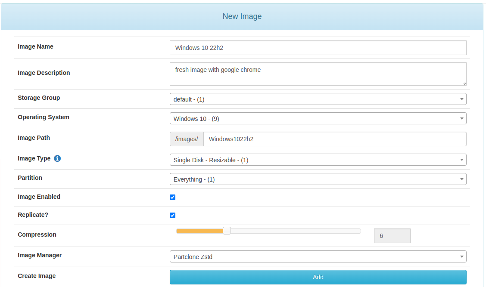
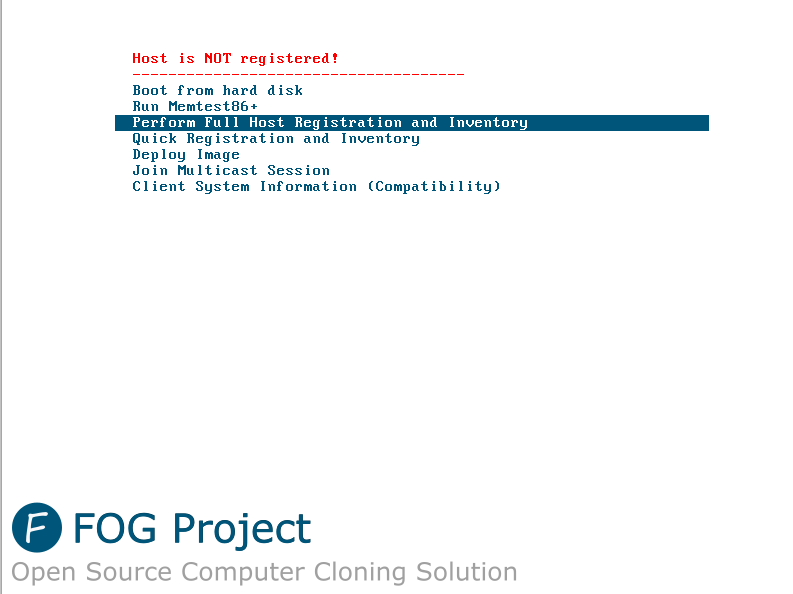
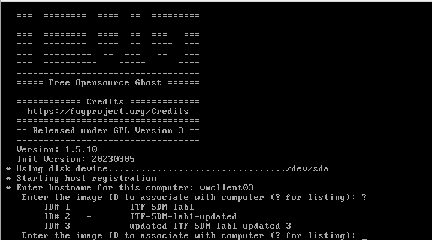
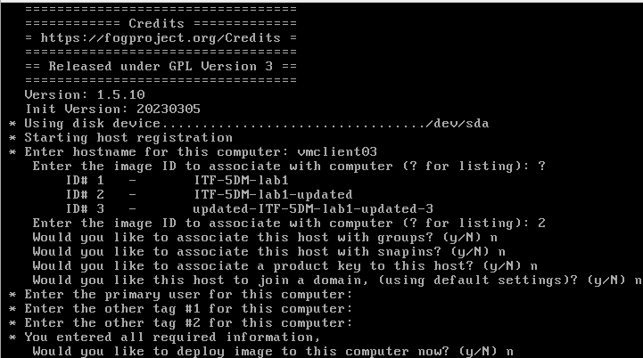
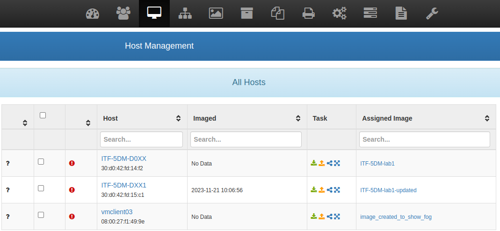
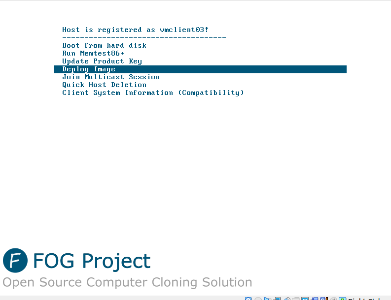

# Fogproject

[Fog project](https://fogproject.org/) is an open-source project designed for deploying and capturing images, using Partclone and PXE. 
The [website](https://fogproject.org/) provides various tools that can be utilized based on your specific requirements. 


## Table of content

* [Dependencies](#dependencies)
* [Service installed by fog](#service-installed-by-fog)
* [Installation](#installation)
* [Create an image](#create-an-image)
* [Register a Host (pxe client)](#register-a-host-pxe-client)
* [Deploy the image to a computer](#deploy-the-image-to-a-computer)
* [Capture an image from a fog client](#capture-an-image)

You need to capture an image before deploying into a new machine

* [Deploy the image you have created and captured](#deploy-the-image-to-a-computer)

## Dependencies 
* git
* openssh-server (usefull to manage through ssh)
* vim (optional)(use for editing from terminal the alternative can be nano)
* nano (optional) An alternative you can use instead of vim.

**Note:
Here’s an example of how to install packages on Debian-based operating systems. (Ubuntu, Xubuntu, ...) :** 
```
apt install -y git openssh-server vim 
```
This command installs Git, OpenSSH Server, and Vim.
With the -y specified option for automatic confirmation.

## Service installed by fog

* DHCP server from fog or other (windows server for example)
* apache (web server)
* PXE
* TFTP
* NFS
## Preparation
**Please note that Fog uses a DHCP service, which may conflict if there is a similar service from Windows Server or elsewhere on the same subnet.**

**Also, in this tutorial, a basic understanding of Linux is recommended.**

To begin, configure your network interface and set a static IP. 

Tips : If your public network already has a DHCP server, you can skip setting up a local network interface.

Here's an example for Ubuntu, using netplan : 

Using [vim](https://www.cyberciti.biz/faq/linux-unix-vim-save-and-quit-command/), I highly suggest to read about vim before using it : 
``` 
* vim /etc/netplan/01-network-manager-all.yaml

OR

* Using nano: 
	nano /etc/netplan/01-network-manager-all.yaml 

```
**In this tutorial you may need to have a little of linux knowledge**
```
vim /etc/netplan/01-network-manager-all.yaml
				OR
nano /etc/netplan/01-network-manager-all.yaml 

---
network:
  version: 2
  renderer: networkd
  ethernets:
    eth1:	#eth1 is the interface name you can check by doing "ip a"
     addresses: [192.168.83.35/24]
     gateway4: 192.168.83.1
     nameservers:
       addresses: [8.8.8.8,8.8.4.4]


# Optional : if can use your dhcp on a public network    
# intern network which will be use for fog (local network) in this example
      
    eth2: addresses:
      - 192.168.10.35/24
     
```

**Note: Feel free to adjust the interface names, IP addresses, gateway and nameservers, based on your network configuration.**

## Installation

Installation wise, I’d recommend using a Debian-based OS. 
In this example, Ubuntu 22.04 will be used. 
*Visit the download page on the Fog Project[Fog Project](https://fogproject.org/download) website and obtain the link from GitHub.* 

* "sudo" let you use administrator command
* "wget or curl" let you download from the web
* "tar -xvf" let extract compress file with *.tar*
* "cd" let you navigate between folder
* "./" let you run script or program
* "ip a" let you know your current network configuration same to ipconfig for Windows based operating system
```
# make sure to update
sudo apt update

# Download the project
wget https://github.com/FOGProject/fogproject/archive/1.5.10.tar.gz

# extract the compress file
tar -xvf 1.5.10.tar.gz

# go to bin
cd fogproject-1.5.10/bin
sudo ./installfog.sh
```
**Note: Be aware that Fog uses a DHCP service.**
 
Note: To choose the interface, please be aware that it will have a DHCP server, so you may want to avoid using the production interface
``` 
Starting Debian based Installation

   ######################################################################
   #     FOG now has everything it needs for this setup, but please     #
   #   understand that this script will overwrite any setting you may   #
   #   have setup for services like DHCP, apache, pxe, tftp, and NFS.   #
   ######################################################################
   # It is not recommended that you install this on a production system #
   #        as this script modifies many of your system settings.       #
   ######################################################################
   #             This script should be run by the root user.            #
   #      It will prepend the running with sudo if root is not set      #
   ######################################################################
   #            Please see our wiki for more information at:            #
   ######################################################################
   #             https://wiki.fogproject.org/wiki/index.php             #
   ######################################################################

 * Here are the settings FOG will use:
 * Base Linux: Debian
 * Detected Linux Distribution: Ubuntu
 
 ## To chose the interface please be aware that it will has a DHCP server so maybe do not put on production interface
 
 
 * Interface: eth2
 * Server IP Address: 192.168.10.35
 * Server Subnet Mask: 255.255.255.0
 * Hostname: HP-Z230-Tower-Workstation
 * Installation Type: Normal Server
 * Internationalization: No
 * Image Storage Location: /images
 * Using FOG DHCP: Yes
 * DHCP router Address: 192.168.10.1
 * Send OS Name, OS Version, and FOG Version: Yes
```
Then let Fog install all the necessary packages. 
Once done, you will be prompted to log in to the webpage (in this case, 192.168.10.35, or 192.168.83.35 if you're using the public network). Please follow the instruction from the web page

At this point, you can now enjoy the Fog Project server from the Fog webpage. (default user: fog, default password: password).

## Fog usage

### Create an image

First of all, create a placeholder for your image by navigating to the *"Image"* section and selecting **"Create an Image"**. 
Customize the settings according to your needs.



### Register a Host (pxe client)
Then head to the PC that you want to create an image of (capture) or register for other purposes.

* Boot from PXE (efi or legacy depending the OS you installed if efi you may have to enable efi pxe from BIOS)

Note that if you’re using EFI, you may have to enable it using the BIOS, prior to the boot).

* Once Fog PXE client has started, perform a full registration.




* Put your DNS name you want your machine OS to have as a hostname
* Select the image you need (same ID as from the fog webpage)



<u>**/!\ DISCLAIMER : **</u>
---
<u>**If you intend to capture your hard drive, refrain from deploying it at this stage; otherwise, your hard drive will be erased.**</u>



### Capture an image
*Note : (The * is intended to indicate an alternative way of doing it)*

#### * From web interface

In the web interface, go to "Host," select the desired host, and click on capture **(The orange icon)**. Head to PXE and the capture will start




### Deploy the image to a computer

#### * From PXE
* Using PXE
 - Boot into PXE.
 - Register the computer.
 - Reboot and then choose to deploy on the last prompt.



Should you forget to deploy after the registration, you can do it through the web interface or using the PXE client.

#### * Deploy from web interface
From the web interface, select the host and click on **deploy** (the green icon), which will clone the captured image into that computer. 
(Note that you first need to register the deployed machine (in PXE)).

From the web interface select the host and click deploy which will clone the image you captured **(green icon)** into that computer (you need to register the deploy machine beforehand in pxe)


